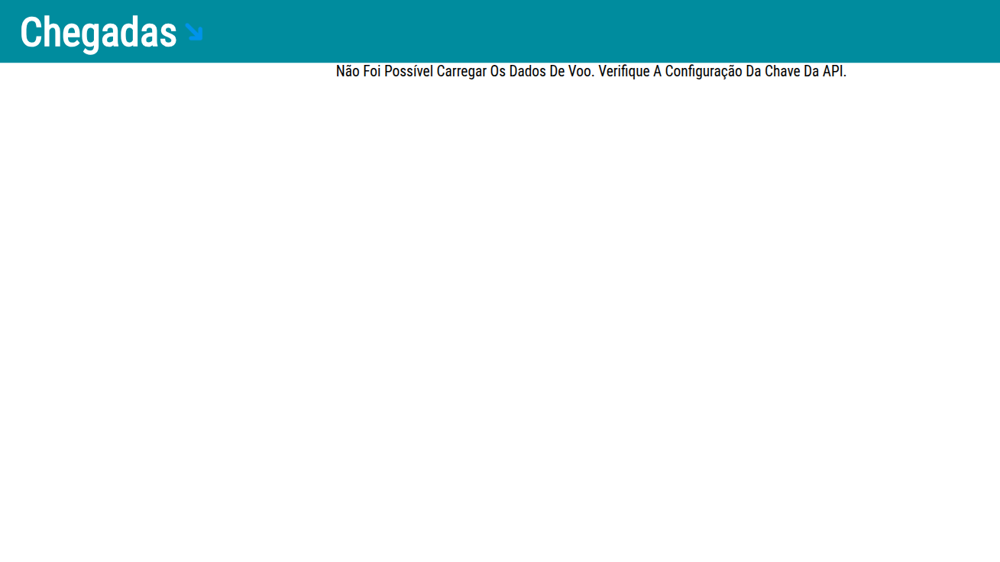

# DSPLAY - Flight Information Template

A [React](https://reactjs.org/) [HTML-based template](https://developers.dsplay.tv/docs/html-templates) for the [DSPLAY - Digital Signage](https://dsplay.tv/) platform — shows a live arrivals/departures board for a given airport, fetched from the [aviation-edge.com](https://aviation-edge.com/) API.

> Built with [Vite](https://vitejs.dev/), requires Node.js 22.22.2+, 24.15.0+, or 26+ (see `.nvmrc`).

## Supported screen formats

- Landscape

  
- Portrait

  
- Square

  

## Template variables

This template has no `dsplay_template` variables — instead, it's configured entirely through **custom `dsplay_media` parameters** (`src/hooks/use-flights-info.js`/`src/components/main/index.jsx` read them via `useMedia()`), since it's meant to be set up in the DSPLAY CMS as a JSON-service-backed media rather than a plain template:

| Key                      | Type   | Description                                                                              |
|--------------------------|--------|-------------------------------------------------------------------------------------------|
| `apiKey`                 | string | API key for [aviation-edge.com](https://aviation-edge.com/)'s flight timetable endpoint.  |
| `iataCode`               | string | IATA code of the airport to display (e.g. `GRU`, `JFK`).                                  |
| `arrivalDeparture`       | string | `"arrival"` or `"departure"` — which flight list to show.                                 |
| `offsetTimeMinutes`      | int    | Minutes in the past a flight can still be shown (filters out older flights).               |
| `maxPageDurationSeconds` | int    | Upper bound, in seconds, on how long each page of flights is displayed while paginating.   |

`duration` (the standard `dsplay_media` field) is also used, to split the total media duration evenly across pages of flights.

> Since these aren't `dsplay_template` variables, they aren't auto-detected by the CMS's template-variable manifest — configure them as custom media parameters when setting up this media source in the DSPLAY CMS instead.

## Local development

```sh
npm install
npm start
```

`public/dsplay-data.js` defines `dsplay_config`/`dsplay_media`/`dsplay_template` mock globals used only when the template isn't running inside the actual DSPLAY app. Edit `dsplay_media` to try out a different airport/API key — the DSPLAY Player App replaces it with real content at runtime.

## Packing (release build)

```sh
npm run zip
```

This builds the template with Vite, which also generates `template-variables.json` + `template-example-data.json` (via [@dsplay/template-manifest](https://www.npmjs.com/package/@dsplay/template-manifest)'s Vite plugin) — the DSPLAY CMS reads these two files to auto-detect this template's variables and seed default preview values. It then generates `template.zip`, ready to be deployed to the [DSPLAY Web Manager](https://manager.dsplay.tv/template/create).

## Test assets

To use test assets (images, videos, etc) during development, put them in the `public/test-assets` folder and reference them in `dsplay-data.js` using their relative path. `public/test-assets` is automatically excluded from the release build.

## Maintaining dependencies

Regular npm dependencies, not vendored files:

```sh
npm outdated
npm update
```

For a version outside the declared range (typically a major bump), apply it deliberately and verify `npm start`, `npm run build`, and `npm test` still work before committing.

### Commit conventions

See [AGENTS.md](AGENTS.md).

## More

To see more about DSPLAY HTML Templates, visit: https://developers.dsplay.tv/docs/html-templates
